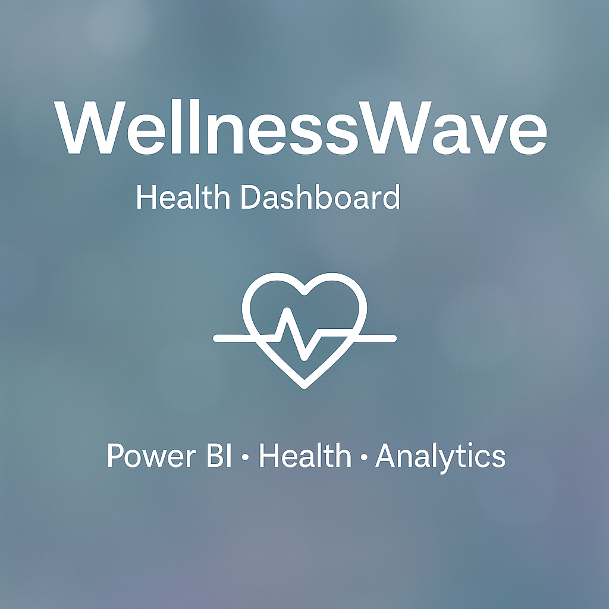

# 🌊 WellnessWave Dashboard

A Power BI health analytics dashboard showing heart rate, sleep, steps, and app usage data.  
Designed to explore health patterns, identify at-risk users, and create business insights.

---

# Health-Dashboard
Power BI project analyzing health data


## 📊 Project Overview

This Power BI dashboard analyzes health and wellness metrics from users data, including:
- Heart Rate
- Steps
- Sleep Hours
- App Usage Minutes

It helps identify **health risk patterns**, monitor user engagement, and visualize wellness insights.

---

## 🎯 Objective

- Detecting users with abnormal heart rate and poor sleep (high risk)
- Understanding activity patterns across cities and age groups
- Monitoring app engagement

---

## 🧠 Key Insights

- Users aged **18–25** have the highest average steps but lowest sleep hours.
- Most **At Risk** users had heart rates > 100 and slept less than 5 hours.
- **Delhi and Bangalore** users show higher app engagement.

---

## 📈 Dashboard Features

| Visual              | Description                                 |
|---------------------|---------------------------------------------|
| Card KPIs           | Average Heart Rate, Sleep, Steps, Usage     |
| Line Chart          | Daily Heart Rate Trend                      |
| Bar Chart           | Steps by Age Group                          |
| Donut Chart         | Gender Distribution      
| Risk Pie Chart      | HealthRisk Segmentation
| Horizontal Bar      | App Usage by City                           |

---

## 🧪 Health Risk Detection Logic

```DAX
HealthRisk = 
IF(
    'curefit_health_data'[HeartRate] > 100 && 'curefit_health_data'[SleepHours] < 5,
    "At Risk",
    "Normal"
)

Used to flag users with high heart rate and low sleep for potential health concerns.

**📂 Files Included
health_data.csv – Sample Dataset

Health_Dashboard.pbix – Power BI File

README.md – Project Overview

📌 **Tools Used**
Microsoft Power BI
DAX
Excel/CSV for data modeling

**🌸 Created By
Alka Mittal
📍 IGDTUW, Delhi | Aspiring Data Analyst
🔗 LinkedIn
📧 am2021374@gmail.com

